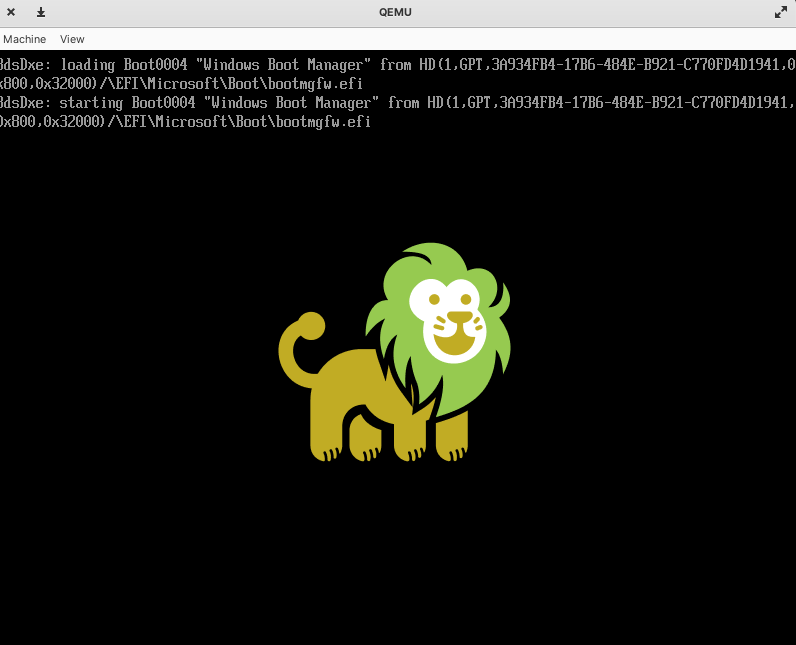
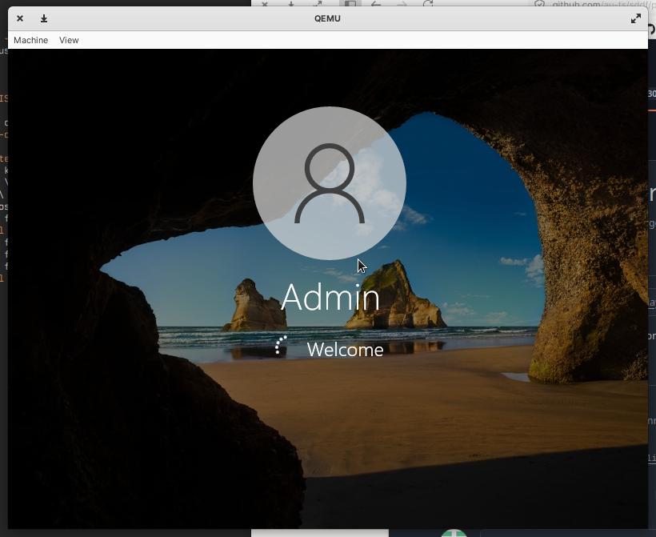

# Windows virtualisation on seL4/LionsOS

Work in progress, only runs on QEMU at the moment.

Windows 10 works, Windows 11 with TPM/Secure Boot checks bypassed also works.

## Prerequisites

Before starting, you'll need a Linux machine with an Intel x86-64 CPU
with VT-x enabled in the BIOS. Your CPU must also support all Intel APICv
acceleration features that we used in the VMM. Internally we used 10th gen CPUs
and they supported all the features. To check whether your CPU
is supported, compile and run the test program `intel_apicv_check.c`:
```
$ gcc intel_apicv_check.c
$ sudo modprobe msr
$ sudo ./a.out
Hardware APICv Support Check
----------------------------
TPR Shadow supported: YES
APIC-Register Virtualization: YES
Virtual Interrupt Delivery: YES
```

You must get 3 YESes for the VMM to work.

### Source code

First step is to acquire the source code and enter the right directory:
```sh
git clone https://github.com/au-ts/lionsos_windows_virt --recursive
cd lionsos_windows_virt/libvmm/examples/uefi
```

### Dependencies

Next, there's a couple dependencies that you need:

* GNU Make
* Clang/LLVM tools
* QEMU
* Python
* Microkit SDK
* Windows disk image

Ubuntu/apt command if you need it:
```sh
sudo apt install -y make clang lld llvm qemu-system-x86 python3 python3-pip
```

Python setup:
```sh
pip3 install sdfgen==0.30.0
```

#### Microkit SDK

```sh
wget https://trustworthy.systems/Downloads/microkit/microkit-sdk-2.1.0-linux-x86-64-apicv.tar.gz
tar xf microkit-sdk-2.1.0-linux-x86-64-apicv.tar.gz
```

#### Windows disk image

##### Pre-installed

This image has Windows 10 pre-installed, it is ~5GB downloaded, ~12GB unzipped.

```sh
wget https://trustworthy.systems/Downloads/windows-vm/disk.img.xz
unxz disk.img.xz
```

##### Build from ISO

See the instructions at [windows/README.md](windows/README.md).
Then either copy or move `lionsos_windows_disk.img` to `libvmm/examples/uefi/disk.img`.

### QEMU

Run with QEMU:
```sh
make MICROKIT_SDK=$(pwd)/microkit-sdk-2.1.0-linux-x86-64-apicv MICROKIT_BOARD=x86_64_generic_vtx qemu
```

It will take a minute or two to boot up, after 5-10 seconds you should see UEFI booting:



And then you should see Windows booting:



#### Troubleshooting

There's one annoying issue that we are in the process of resolving that you may run into.
Currently, at build-time we hard-code the physical addresses of the virtIO PCI devices that we use to
give the VM block and network access.

You may see this error:
```
BLK DRIVER|ERROR: driver does not support device capacity smaller than 0x1000 bytes (device has capacity of 0x0 bytes)
Failed assertion 'false' at /home/ivanv/ts/windows_work/libvmm_windows_checkpoint/libvmm/dep/sddf/drivers/blk/virtio/pci/..//block.c:292 in function virtio_blk_init
MON|ERROR: received message 0x00000003  badge: 0x0000000000000009  tcb cap: 0x0000000000000012
MON|ERROR: faulting PD: blk_driver
Registers:
rip : 0x0000000000204847
rsp: 0x00007fffffffef70
rflags : 0x0000000000010206
rax : 0x00000000000000a5
rbx : 0x0000000000000000
rcx : 0xffffffffffffffff
rdx : 0x00000000000000a5
rsi : 0x00007fffffffef5f
rdi : 0x0000000000000000
rbp : 0x00007fffffffef70
r8 : 0x0000000000000000
r9 : 0x0000000000000000
r10 : 0x0000000000203058
r11 : 0x00000000000000a5
r12 : 0x0000000000000000
r13 : 0x0000000000000000
r14 : 0x0000000000000000
r15 : 0x0000000000000000
fs_base : 0x0000000000000000
gs_base : 0x0000000000000000
MON|ERROR: UserException
```

If you do, you can do `CTRL + a` then `c` while running QEMU to drop down into the QEMU monitor.
From there, if you run this command:
```sh
info pci
```

You'll see something like this:
```
  Bus  0, device   2, function 0:
    Ethernet controller: PCI device 1af4:1000
      PCI subsystem 1af4:0001
      IRQ 10, pin A
      BAR0: I/O at 0xc080 [0xc09f].
      BAR1: 32 bit memory at 0xfebc0000 [0xfebc0fff].
      BAR4: 64 bit prefetchable memory at 0x380000000000 [0x380000003fff].
      BAR6: 32 bit memory at 0xffffffffffffffff [0x0003fffe].
      id ""
  Bus  0, device   3, function 0:
    SCSI controller: PCI device 1af4:1001
      PCI subsystem 1af4:0002
      IRQ 11, pin A
      BAR0: I/O at 0xc000 [0xc07f].
      BAR1: 32 bit memory at 0xfebc1000 [0xfebc1fff].
      BAR4: 64 bit prefetchable memory at 0x380000004000 [0x380000007fff].
      id "virtblk0"

```

Note that the BAR4s are at the base address `0x380000000000`. This is the important bit that
can change depending on the host and is determined at run-time, rather than being fixed for all
instances of QEMU.

Instead, supply `PCI_BASE=<base>` on the Make command which should make the assert go away and
boot the VM.
